# FolioHarbor 第一条 EPUB 端到端纵切设计

状态：已批准，实施计划已编制

日期：2026-08-05

## 1. 文档定位

本文是 FolioHarbor 的第一份可实施设计规格。它只描述第一条 EPUB 端到端纵切，不等同于完整 1.0 产品规格。

相关背景：

- [全量 Brainstorm 纪要](../../research/2026-08-04-to-2026-08-05-full-brainstorm.md)
- [产品愿景与范围](../../requirements/product-vision.md)
- [核心领域模型](../../architecture/core-domain-model.md)
- [标准应用规范草案](../../standards/application-profile.md)
- [ADR 索引](../../README.md)

本文中的“必须”“不得”“应当”是第一纵切的验收约束。“未来”章节只定义兼容边界，不授权在本纵切中实现对应功能。

## 2. 目标

从空 PostgreSQL 数据库开始，两个新用户可以完成以下真实路径：

```text
本地邮箱注册与验证
→ 首次登录创建个人书库
→ owner 邀请第二位用户
→ 分配 owner/editor/reader
→ owner/editor 上传 EPUB
→ Worker 校验、解析并建立标准书目与馆藏
→ 用户浏览图书详情
→ 在线阅读并保存跨设备进度
→ 按独立下载权限获取原始 EPUB
```

该纵切用于验证：

- 多用户身份与协作书库模型；
- PostgreSQL RLS 与统一授权；
- WEMI 书目、馆藏、逻辑副本和 Blob 分层；
- 文件系统与数据库之间的可恢复导入流程；
- 不永久解包 EPUB 的在线阅读；
- Web 与未来 Android 共用的数据和 API 契约；
- 从空库部署、版本化 migration 和故障恢复。

## 3. 范围

### 3.1 必须实现

- 本地邮箱注册、验证、登录、登出和密码重置；
- 公开注册和邮箱验证配置；
- 首次登录幂等创建个人书库；
- 书库邀请、成员管理和三个内置角色；
- PostgreSQL-only 持久化；
- 本地文件系统 Blob 存储；
- EPUB 上传、校验、解析和幂等去重；
- WEMI、Holding、Item、Blob 和 PublicationPackage；
- 全部图书、图书详情、上传中心和成员设置页面；
- EPUB Web 阅读器、目录和阅读显示设置；
- 跨设备阅读进度；
- 原始 EPUB Range 下载；
- 书库逻辑配额和物理空间保护；
- API/Worker 持久任务与重试；
- RLS、应用授权、CSRF 防护和追加式审计；
- RFC 9457 错误契约；
- 结构化日志、指标、追踪和健康检查；
- Docker Compose 单机部署；
- 简体中文和英文消息目录；
- WCAG 2.2 AA 产品界面基线。

### 3.2 明确不实现

- OIDC；
- S3 对象存储；
- TXT、PDF、漫画和有声书；
- Meilisearch；
- 批注 UI 和批注持久化；
- 公开书目、匿名阅读或公开下载；
- ActivityPub、OPDS 和中心评价站；
- 自定义角色和通用资源 ACL；
- 旧 `ebooks-go` 数据迁移；
- 微服务、Redis、Kafka、RabbitMQ；
- 完整备份调度系统；
- Android 客户端。

## 4. 完成标准

- 全新 PostgreSQL 可以通过 migration 创建完整 schema；
- API、Worker 和 Web 可以使用官方 Compose 启动；
- 两个用户能够完成目标路径；
- reader 无法上传、修改馆藏或管理成员；
- 未加入书库的用户不能枚举书目、任务、文件或 Blob；
- 重复提交相同 EPUB 不产生重复馆藏；
- API 或 Worker 重启不丢失上传和导入状态；
- 多设备进度同步能识别并处理冲突；
- reader 在线阅读不自动获得下载权限；
- 删除一个 Item 不会删除其他 Item 仍引用的 Blob；
- 权限拒绝和管理操作可追踪；
- CI 通过真实 PostgreSQL、RLS、安全 EPUB 和双用户端到端测试。

## 5. 总体架构

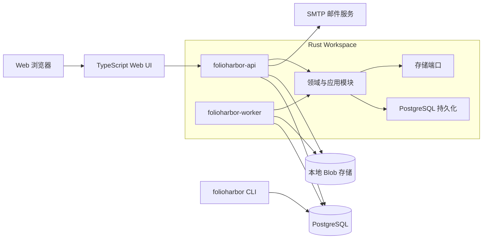

部署和代码组织采用：

- 一个 Git 仓库；
- 一个 Rust workspace；
- 一个 TypeScript Web 应用；
- 一个 PostgreSQL 数据库；
- API 与 Worker 两个独立运行进程；
- 一个 migration/admin CLI；
- 一个可替换但第一纵切只有本地实现的 Storage Port。

第一纵切不引入远程消息队列。PostgreSQL 是业务事实源，也是持久任务队列。

## 6. 模块边界

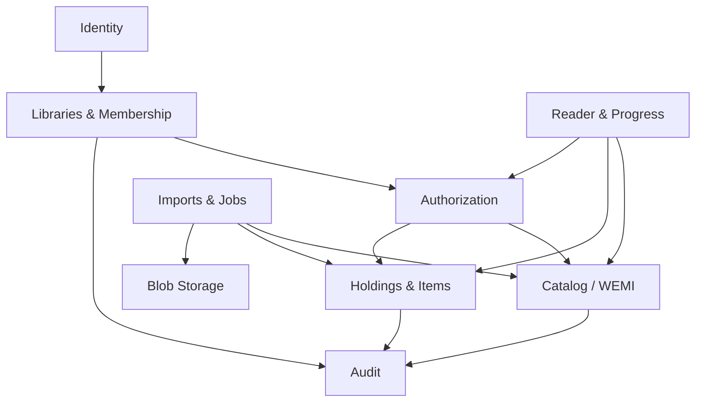

每个模块必须：

- 通过公开应用接口暴露行为；
- 拥有自己的事务入口和持久化实现；
- 不直接修改其他模块表；
- 不向领域层暴露 SQLx Row、文件路径或 HTTP 类型；
- 使用稳定领域 ID 和显式错误类型协作。

## 7. PostgreSQL 决策

第一纵切只支持 PostgreSQL：

- 官方部署与 CI 固定使用 PostgreSQL 18.x；扩大支持版本范围前必须加入对应集成测试；
- 使用 SQLx `PgPool`，不使用 `AnyPool`；
- migration 可以使用 RLS、JSONB、advisory lock、`FOR UPDATE SKIP LOCKED` 和部分索引；
- 集成测试运行真实 PostgreSQL；
- 不维护 MySQL 或 SQLite migration；
- API 启动时只检查 schema 版本，不推测或生成 schema 变更。

数据库角色至少分为：

- `folioharbor_owner`：migration 和 schema owner，不被运行进程使用；
- `folioharbor_api`：非 owner、无 `BYPASSRLS`；
- `folioharbor_worker`：非 owner、无 `BYPASSRLS`，只拥有任务处理所需权限。

## 8. 身份与书库模型

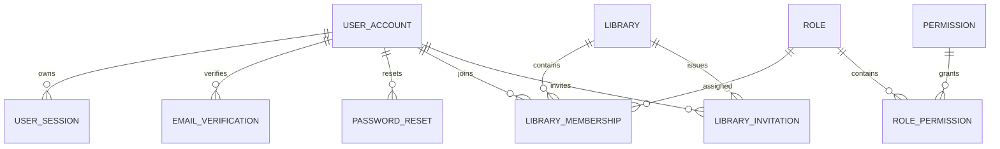

约束：

- 邮箱规范化后全实例唯一，同时保存展示形式；
- Session、邮箱验证、邀请和密码重置只保存令牌哈希；
- 每个用户最多一个系统创建的个人书库；
- 创建个人书库与 owner membership 在同一事务完成；
- 每个 Library 至少保留一个 owner；
- 内置角色不可由用户修改；
- 邀请绑定规范化邮箱、书库、角色、过期时间和单次使用状态；
- 受邀注册不替代个人书库。

## 9. 书目、馆藏和存储模型

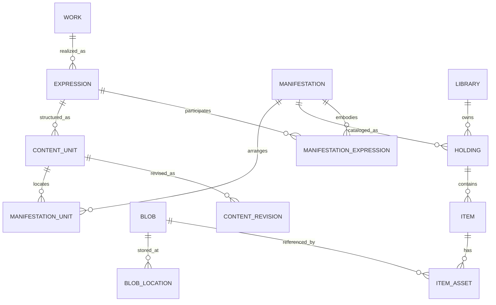

实体语义：

- Work：抽象作品；
- Expression：翻译、修订或其他表达；
- Manifestation：具体出版和技术形态；
- Holding：某书库对某 Manifestation 的馆藏；
- Item：该馆藏下的逻辑电子副本；
- ItemAsset：副本的原始文件引用；
- Blob：不可变字节及内容哈希；
- BlobLocation：本地或未来对象存储中的位置；
- ContentUnit：卷、章、话、页或音轨等逻辑单元；
- ManifestationUnit：内容单元在具体出版物中的顺序和定位。

关键不变量：

- WEMI 是实例级目录，不属于某个 Library；
- 普通用户只能通过可访问 Holding 获取目录信息；
- 一个 Library 对同一 Manifestation 默认只有一个有效 Holding；
- 一个 Item 只能属于一个 Holding；
- 第一纵切一个 Item 只需要一个 `original` ItemAsset；
- Blob 不拥有书目语义或权限；
- Blob 去重身份为 `storage_namespace + sha256 + byte_size`；
- 同一书库相同文件返回已有 Item；
- 不同书库可以分别拥有 Item 并共享 Blob；
- 标题、作者或标识符相似不触发自动目录合并。

`storage.dedup_scope` 支持 `instance`、`library` 和 `disabled`，默认 `instance`：

- `instance` 使用实例固定 storage namespace，相同字节可以跨书库复用 Blob；
- `library` 使用书库稳定 storage namespace，只在同一书库内复用 Blob；
- `disabled` 为新逻辑副本分配独立 namespace，不复用物理 Blob；
- 无论去重范围如何，同一书库相同文件的重复上传仍先按 ItemAsset 查询并返回已有 Item；
- 修改去重范围只影响新写入，不在配置加载时搬迁、合并或拆分既有 Blob。

## 10. EPUB 技术模型

WEMI 不承载解析器版本和 ZIP 条目，因此使用非书目实体 PublicationPackage：

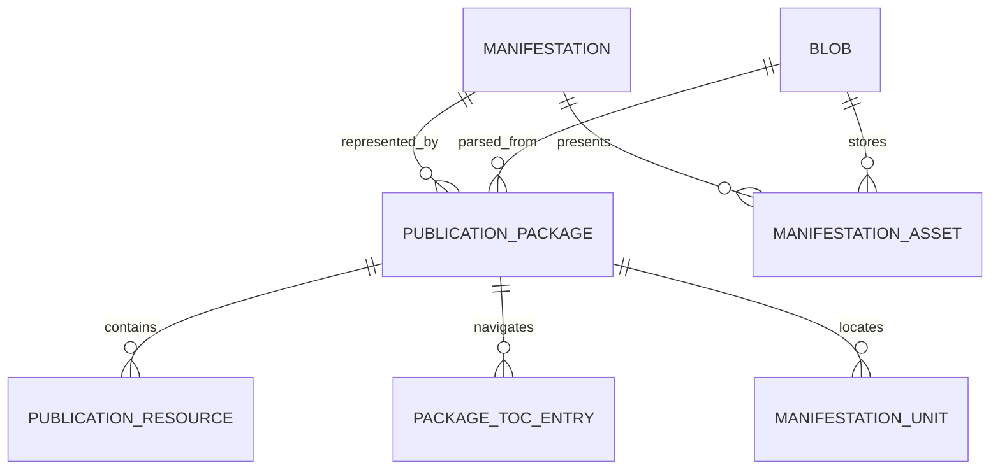

- PublicationPackage 唯一键包含 `blob_id + parser_profile_version`；
- PublicationResource 保存规范化 href、媒体类型、spine 顺序和 EPUB properties；
- PackageTocEntry 保存嵌套导航；
- ManifestationAsset 第一纵切用于封面衍生 Blob；
- HTML、CSS、图片和字体仍只存在于原始 EPUB；
- 解析器升级创建新的 Package，不改写原始 Blob；
- EPUB 包内路径永远不直接成为外部资源 URL。

## 11. 阅读状态与设备

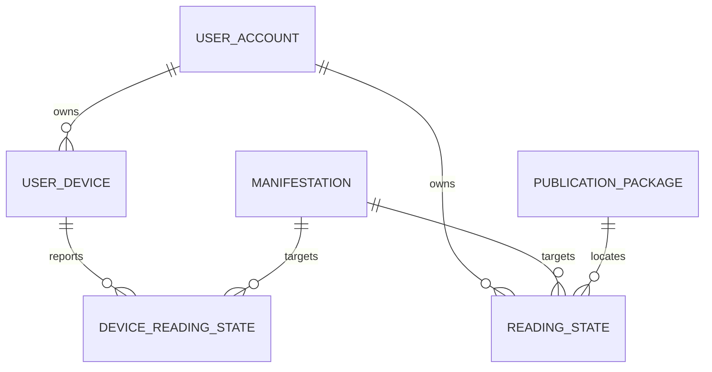

ReadingState 保存：

- user；
- manifestation；
- 可选 publication package；
- 可选 content unit；
- Readium Locator JSON；
- 单调递增 version；
- 服务端更新时间。

DeviceReadingState 额外保存 device 和最近设备位置。

规则：

- 每次更新包含 device ID、client mutation ID 和 base version；
- client mutation ID 在用户范围内唯一；
- 服务端时间决定写入顺序，不信任客户端时钟；
- 过期离线更新可以更新设备位置，不得静默覆盖更新的全局位置；
- 冲突返回全局位置和设备位置；
- 不使用“最大百分比获胜”；
- 阅读状态不属于 Library；
- 用户失去所有正文访问权后保留状态，但不能用它读取正文。
- Package 被重新解析或回收时，ReadingState 保留 Locator 快照并允许清空 package 引用；重新获得兼容版本时可以显式重关联，不按百分比静默迁移。

第一纵切不实现 Annotation 表，但 ID、Locator、版本和同步协议必须兼容未来 W3C Web Annotation。

## 12. 本地身份和会话安全

- 使用 Argon2id；
- 参数不低于 19 MiB 内存、2 次迭代、并行度 1，并允许向上校准；
- 使用每密码随机盐；
- 浏览器使用不透明随机 Session ID；
- Cookie 为 `HttpOnly; Secure; SameSite=Lax`；
- 数据库只保存 Session ID 哈希；
- 修改操作验证 CSRF Token；
- 登录、修改密码和权限提升时轮换 Session；
- 支持空闲过期、绝对过期、撤销单设备和撤销全部设备；
- 登录和找回密码响应不泄露邮箱是否存在；
- 注册、登录、验证、邀请和重置分别限流；
- 验证、邀请和重置令牌单次使用并独立过期。

参考：[OWASP Password Storage](https://cheatsheetseries.owasp.org/cheatsheets/Password_Storage_Cheat_Sheet.html) 与 [OWASP Session Management](https://cheatsheetseries.owasp.org/cheatsheets/Session_Management_Cheat_Sheet.html)。

## 13. 授权和 RLS

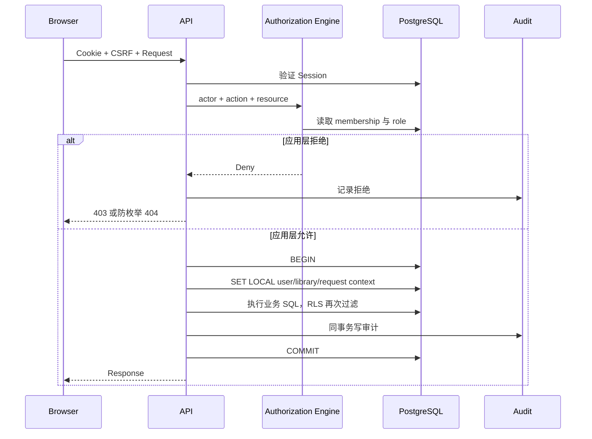

要求：

- 敏感表启用并强制 RLS；
- 没有上下文或策略时默认拒绝；
- API/Worker 均不是表 owner 且无 `BYPASSRLS`；
- 所有业务查询在事务中执行；
- 使用事务级 `SET LOCAL`，禁止会话级租户上下文；
- 书库所属表在语义允许时直接保存 library ID；
- Worker 根据持久任务设置 library、job 和 actor context；
- Security Definer 函数数量最小，并固定 `search_path`；
- 搜索、签名下载和前端隐藏不能代替服务端授权；
- 全局 WEMI 查询必须通过可访问 Holding 或受控 Worker 导入路径。

第一纵切角色矩阵：

| 动作 | owner | editor | reader |
| --- | --- | --- | --- |
| 管理书库设置 | 允许 | 拒绝 | 拒绝 |
| 邀请、移除成员 | 允许 | 拒绝 | 拒绝 |
| 上传 EPUB | 允许 | 允许 | 拒绝 |
| 修改馆藏元数据 | 允许 | 允许 | 拒绝 |
| 移除 Holding/Item | 允许 | 允许 | 拒绝 |
| 在线阅读 | 允许 | 允许 | 允许 |
| 下载原文件 | 允许 | 允许 | 按书库设置 |
| 管理自己的进度 | 允许 | 允许 | 允许 |

reader 下载默认关闭，owner 可以在书库级开启。阅读和下载在授权引擎中始终是不同动作。

## 14. 上传和导入

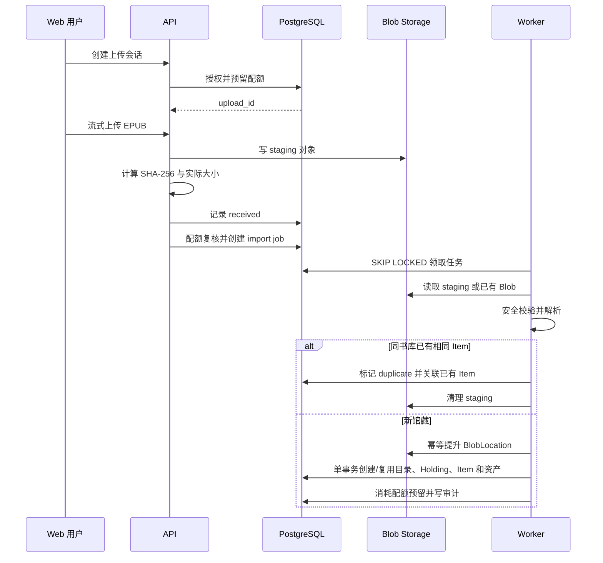

上传要求：

- 创建上传会话必须声明文件名、媒体类型和预计字节数；
- API 流式接收，不整体缓冲文件；
- staging 使用不可预测对象键；
- 传输中计算 SHA-256 和实际字节数；
- 实际字节数超过声明值、单文件上限或已预留容量时立即终止并清理；
- 开始时预留配额，完成接收时复核，创建 Item 时计费；
- 数据库与文件系统采用可恢复 Saga；
- staging、Blob 提升、任务和最终写库均幂等；
- 只有导入成功后 Holding/Item 才对书库可见；
- 跨书库物理去重不得泄露其他书库存在性；
- ZIP 条目限制数量、总解压量、压缩比、路径深度和处理时间；
- 拒绝绝对路径、路径穿越和规范化后重复路径；
- 确定性格式错误不重试；
- 临时数据库和 IO 错误使用带抖动的指数退避；
- 失败文件隔离 24 小时后清理；
- 过期上传、任务租约和配额预留有独立清理任务。

导入状态：

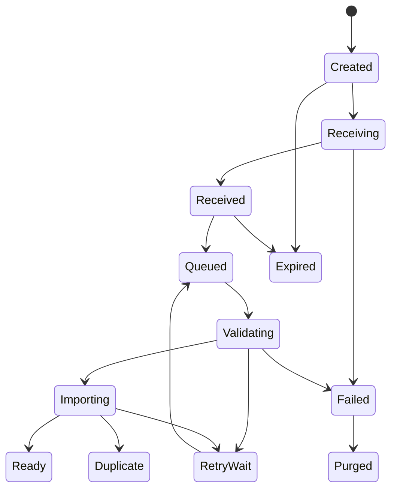

Worker 使用租约和心跳。任务可能至少执行一次，领域结果必须保持一次。

## 15. EPUB 阅读资源

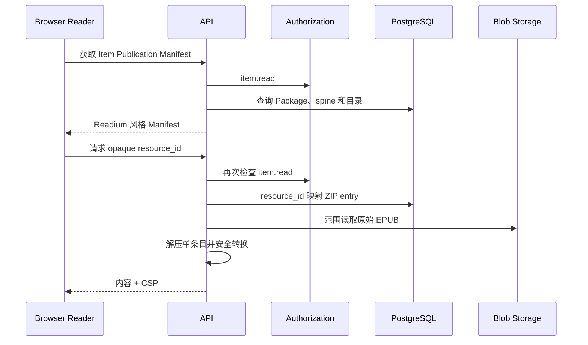

要求：

- 资源 API 使用不透明 ID；
- 不暴露 ZIP 路径、BlobLocation 或本地路径；
- 每个资源请求重新检查 `item.read`；
- 只解压被请求条目，不解压整本；
- 禁用 script、事件处理器、form、iframe、object 和 meta refresh；
- 拒绝外部网络资源；
- 相对 URL 重写为受控资源 ID；
- 阅读内容运行在 sandboxed iframe；
- CSP 默认 `default-src 'none'` 并最小化开放资源类型；
- 安全转换是可重建缓存，不修改原始 Blob；
- 第一纵切采用连续滚动或基础分页，不实现复杂排版引擎。

Manifest 与 Locator 遵循 Readium 模型：

- [Readium Web Publication Manifest](https://readium.org/webpub-manifest/)
- [Readium Locator](https://readium.org/architecture/models/locators/)

## 16. 原文件下载

下载流程：


响应必须提供：

- 正确 Content-Type；
- Content-Length；
- 安全 Content-Disposition 文件名；
- 基于 Blob 身份的强 ETag；
- HTTP Range；
- 内容摘要和明确版本；
- `X-Content-Type-Options: nosniff`。

客户端不得获得真实本地路径或永久存储凭证。

## 17. 跨客户端同步兼容

Web、未来 Android 和未来离线 Web 使用同一版本化 HTTP API：

```mermaid
flowchart LR
    Web[Web Reader] --> API[/api/v1]
    Android[Future Android] --> API
    PWA[Future Offline Web] --> API
    API --> Sync[Reading Sync Service]
    Sync --> PG[(PostgreSQL)]
```

第一纵切实现 ReadingState 和 DeviceReadingState，不实现批注或批量离线同步端点，但必须遵守：

- Web API 不使用无法由 Android 表达的 DOM-only 位置；
- Locator 同时保存 href、媒体类型、结构位置和文本上下文；
- API Handler 依赖统一 Actor，不依赖 Cookie 传输细节；
- 单资源更新支持 ETag/If-Match 或等价 version；
- client mutation ID 支持安全重试；
- 未来批注使用稳定 UUID、W3C Target/Selector、version 和 tombstone；
- 未来增量同步 cursor 不暴露全局活动序号；
- 权限丢失需要产生客户端可理解的不可访问状态。

## 18. API 错误契约

错误响应使用 RFC 9457 `application/problem+json`。

自定义问题的 `type` 为实例公开 Base URL 下的 `/problems/{code}`，其中 `{code}` 替换为实际问题代码；该路径必须返回问题文档。跨实例稳定识别使用响应中的 `code` 字段。

示例：

```json
{
  "type": "https://library.example/problems/quota-exceeded",
  "title": "Library storage quota exceeded",
  "status": 409,
  "detail": "The upload cannot be completed with the current quota.",
  "instance": "/problems/01JEXAMPLE",
  "code": "quota_exceeded",
  "request_id": "01JEXAMPLE"
}
```

状态码：

- 400：请求结构错误；
- 401：未认证；
- 403：可见资源上的动作被拒绝；
- 404：资源不存在或不得发现；
- 409：版本、状态或配额冲突；
- 413：单次上传绝对大小超限；
- 422：同步可确定的语义验证失败；
- 429：限流，并带 Retry-After；
- 503：临时依赖不可用；
- 507：物理存储空间不足。

错误不得暴露 SQL、路径、堆栈、存储键或其他租户信息。

参考：[RFC 9457](https://www.rfc-editor.org/rfc/rfc9457.html)。

## 19. 后台错误和恢复

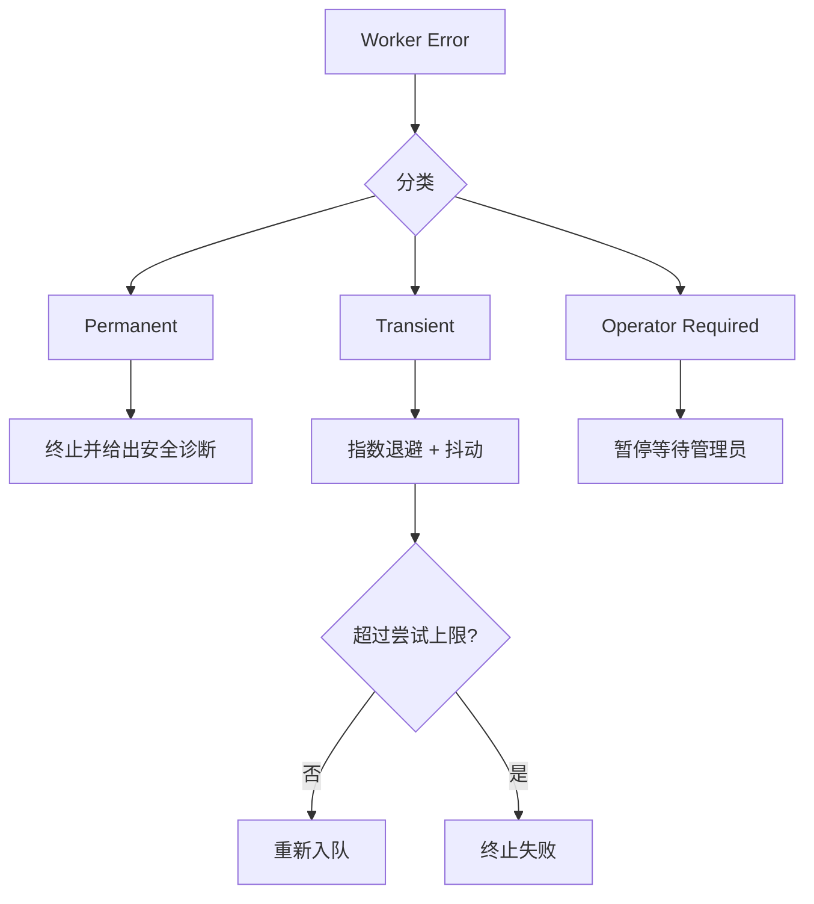

- 永久错误不自动重试；
- 临时错误按任务策略重试；
- 配置、schema 或持续空间问题进入 operator-required；
- 每次尝试记录时间、分类、摘要和下一次时间；
- 用户只看到稳定 code 和安全摘要；
- 管理员重新执行仍使用原幂等键。

## 20. 删除和 Blob 回收

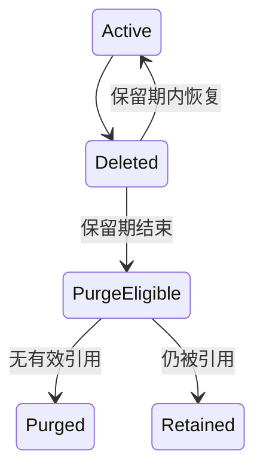

- 删除 Holding/Item 立即撤销访问；
- 默认恢复窗口 7 天；
- Blob 只有在无 ItemAsset、ManifestationAsset 等权威资产引用时可进入回收；
- PublicationPackage、PublicationResource 和安全转换缓存属于可重建解析产物，不是阻止源 Blob 回收的权威引用；
- 回收源 Blob 前，事务内删除对应可重建 Package 数据，并将 ReadingState 的 package 引用清空，但保留 Manifestation、ContentUnit 和 Locator 快照；
- Blob 回收经过独立安全等待期，默认 24 小时；
- 存储文件删除成功后才标记 BlobLocation purged；
- 删除失败可幂等重试；
- 审计不随资源删除；
- 移除成员立即失去访问，不等待资源恢复期。

## 21. 配额

- 配额属于 Library；
- 统计原文件和永久衍生文件逻辑字节；
- 跨书库物理去重不减少逻辑用量；
- staging、临时缓存和可重建索引不计长期配额；
- 默认每书库 5 GiB；
- 默认单文件上限 1 GiB；
- 本地存储默认保留至少 1 GiB 空闲；
- 上传开始预留、接收完成复核、Item 创建时计费；
- 并发上传必须在数据库锁内复核；
- 空间保护触发时拒绝上传但继续允许阅读。

## 22. 审计

持久审计至少保存：

- actor 和有效身份；
- library；
- action；
- resource 类型与 ID；
- allow/deny 与原因码；
- request ID 或 job ID；
- 时间和来源类型；
- 必要且最小化的网络上下文。

成员、角色、上传、删除、下载、配额和拒绝的修改操作进入持久审计。高频阅读资源请求进入结构化访问日志；拒绝读取可以聚合和限流。日志不得保存密码、令牌、Cookie 或正文。

## 23. 可观测性

- API 和 Worker 输出结构化 JSON 日志；
- request ID、job ID 和 trace ID 可以跨进程关联；
- 接受和传播 W3C `traceparent`；
- 使用 OpenTelemetry API，导出器由部署配置决定；
- 指标包括延迟、错误、任务积压、重试、上传字节、存储余量和连接池；
- 指标标签不得包含邮箱、书名、Blob 哈希或用户 ID；
- `/health/live` 只判断进程存活；
- `/health/ready` 检查数据库、schema 版本、管理员引导状态和必要存储能力；
- 上传、解析和下载设置超时、并发上限和背压。

参考：

- [W3C Trace Context](https://www.w3.org/TR/trace-context/)
- [OpenTelemetry](https://opentelemetry.io/docs/)

## 24. 部署

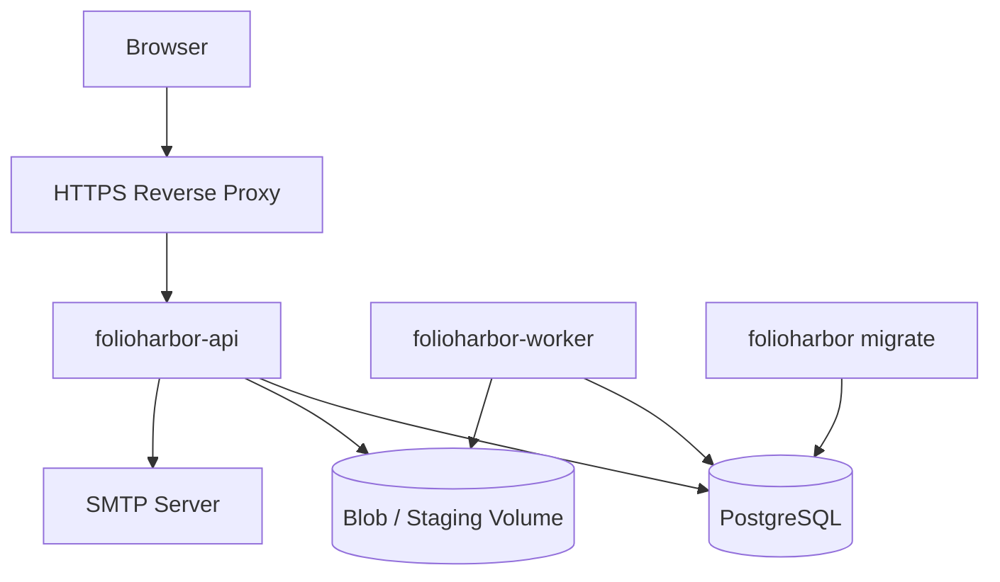

官方 Compose 包含 PostgreSQL、一次性 migration、API、Worker 和共享 Blob Volume。开发环境可以加入邮件捕获服务；生产使用外部 SMTP。HTTPS 由反向代理终止。

配置优先级：

```text
内置默认值 < TOML < FOLIOHARBOR_* 环境变量 < 命令行参数
```

秘密通过环境变量或 `_FILE` secret 注入。第一纵切不热加载配置。

默认值：

| 配置 | 默认值 |
| --- | --- |
| 公开注册 | 开启 |
| 邮箱验证 | 开启 |
| 自动个人书库 | 开启 |
| reader 下载 | 关闭 |
| 书库配额 | 5 GiB |
| 单文件上限 | 1 GiB |
| 失败上传隔离 | 24 小时 |
| Item 恢复期 | 7 天 |
| Blob 回收安全期 | 24 小时 |
| 最低剩余空间 | 1 GiB |
| Worker 并发 | 根据 CPU，最小 1 |
| Blob 去重范围 | 实例级 |

## 25. 管理员引导与邮件

第一个公开注册用户不会自动成为系统管理员。

```text
folioharbor migrate
→ folioharbor admin create --email admin@example.com
→ 从 TTY 安全输入密码
→ 创建已验证系统管理员
→ 启动外部服务
```

- CLI 不接受明文密码参数；
- 系统管理员与 Library owner 分离；
- 系统管理员默认不能读取内容；
- 尚未创建管理员时 readiness 返回 bootstrap-required；
- 管理员完成引导后才启用公开注册；
- 启用验证、邀请或重置时必须配置 SMTP；
- SMTP 短暂不可用不阻止已有用户阅读；
- 邮件通过持久任务发送并使用幂等键；
- 日志不打印完整验证或邀请 URL；
- 邮件同时提供纯文本和 HTML；
- 链接使用验证过的公开 Base URL。

## 26. 备份边界

- PostgreSQL 与 Blob Volume 必须作为同一业务备份集合；
- 备份清单记录数据库时间点、schema 版本和 Blob 水位；
- staging、缓存和未来 Meilisearch 不进入长期备份；
- 恢复后运行一致性检查，报告缺失 Blob、孤立位置和哈希错误；
- 第一纵切提供操作手册和校验命令，不实现备份调度器。

## 27. Web 信息架构

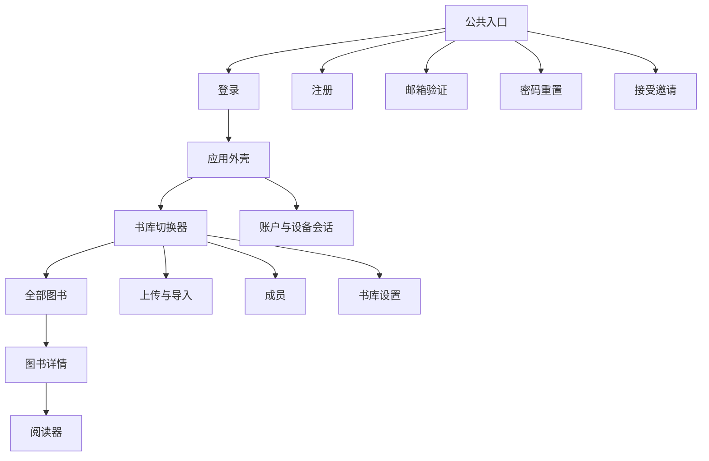

主要路由：

```text
/login
/register
/verify-email
/forgot-password
/reset-password
/invitations/:token
/libraries/:library_id/books
/libraries/:library_id/uploads
/libraries/:library_id/members
/libraries/:library_id/settings
/libraries/:library_id/items/:item_id
/libraries/:library_id/items/:item_id/read
/account/profile
/account/sessions
```

不存在全实例“全部图书”。全部图书只表示当前 Library 的可访问 Holding。

## 28. Web 交互要求

- 当前书库名称始终可见；
- 个人书库和共享书库在同一切换器中；
- owner/editor 才显示上传；
- owner 才显示成员和关键设置；
- 用户界面使用“作品”“版本/格式”“书库副本”，不暴露 Blob 等内部术语；
- 上传中心区分传输和后台处理；
- Duplicate 直接链接已有 Item；
- 页面重载后任务仍可见；
- 邀请绑定邮箱，错误账户只看到遮蔽邮箱；
- 接受邀请后同时保留个人书库；
- 图书详情分别展示在线阅读和下载；
- reader 无下载权时明确显示“仅在线阅读”；
- 阅读器提供目录、基础排版、进度与同步状态；
- 第一纵切不显示批注入口。

产品 UI 以 [WCAG 2.2 AA](https://www.w3.org/TR/WCAG22/) 为目标，并要求：

- 键盘可操作；
- 清晰焦点；
- 语义标题和标签；
- 不只用颜色表达状态；
- ARIA live 通知上传状态；
- 支持减少动画和文字缩放；
- 简体中文和英文消息目录；
- API code 和字段不随显示语言变化。

## 29. API 与未来客户端

- API 基础路径为 `/api/v1`；
- OpenAPI 3.1 是 HTTP 契约事实源；
- TypeScript 客户端模型从契约生成；
- 设计必须允许未来生成 Kotlin 模型；
- Cookie 和未来 Bearer Token 都映射为统一 Actor；
- Web 不调用私有数据库接口；
- 下载、Manifest、Locator 和同步语义对 Web 与 Android 一致。

## 30. 测试策略

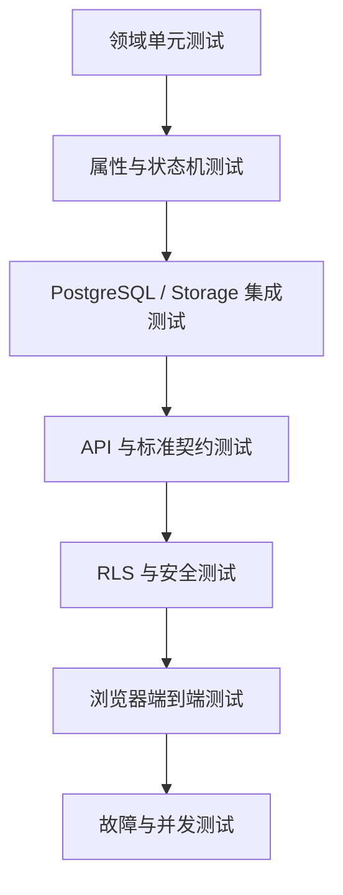

必须覆盖：

- 角色矩阵和最后 owner 约束；
- 配额预留、计费和释放；
- 上传、任务、删除状态机；
- Blob 引用和回收；
- ReadingState 版本冲突和 mutation 幂等；
- 所有租户表无上下文默认拒绝；
- Alice 不能读取 Bob 的 Library；
- 运行角色不能绕过 RLS；
- 连接池复用不遗留上下文；
- 正常、损坏和恶意 EPUB；
- 原始 EPUB 哈希保持不变；
- RFC 9457、Readium、Range 和 ETag 契约；
- 双用户浏览器验收；
- Worker 崩溃恢复；
- 并发上传配额竞争；
- 跨书库 Blob 删除安全；
- CSRF、过期和撤销 Session。

测试数据只使用程序生成数据或明确许可的公共领域 EPUB。

## 31. Migration 测试

CI 必须：

1. 创建全新 PostgreSQL；
2. 从零运行全部 migration；
3. 启动 API 和 Worker；
4. 验证最小读写与 RLS；
5. 再次执行 migrate 并确认无重复应用；
6. 验证数据、约束和 schema 版本。

首个正式版本发布后，仓库必须保留最近一个受支持正式版本的 schema fixture；从第二个版本开始，CI 还必须从该 fixture 升级并验证代表性数据。若以后同时支持多个直接升级起点，测试矩阵必须覆盖声明的每个起点。

不要求所有 migration 向下回滚。不可逆迁移必须声明备份要求，并提供前滚修复策略。

## 32. CI 门禁

- Rust 格式与静态检查；
- Rust 单元和集成测试；
- TypeScript 格式、类型和组件测试；
- API 契约测试；
- PostgreSQL migration 与 RLS 测试；
- Playwright 双用户端到端测试；
- 依赖漏洞、许可证和秘密扫描；
- Docker 镜像构建和最小启动测试。

性能首先验证资源增长方式：

- 上传内存不随文件大小线性增长；
- 阅读不解压整本 EPUB；
- 任务队列具备背压；
- Worker 并发可降为 1；
- 缓存达到上限后可回收。

具体延迟和并发目标由后续部署性能规格基于参考硬件定义，不属于本纵切功能验收。

## 33. 未来兼容边界

以下内容不在本纵切实现，但当前设计不得阻碍：

- OIDC Authorization Code + PKCE；
- S3 分段或预签名上传；
- TXT、PDF、漫画和有声书的 Manifestation/Package；
- Meilisearch 内容单元索引；
- W3C Web Annotation 和 tombstone 同步；
- Android 整本下载与离线同步；
- 资源级 ACL 和自定义角色；
- OPDS 2.0；
- ActivityPub 与 ActivityStreams；
- 旧 HTML 规范化和章节包含关系迁移。

这些兼容边界不能成为预先实现未使用抽象的理由。新增能力必须单独完成 Brainstorm、规格和实施计划。

## 34. 验收场景

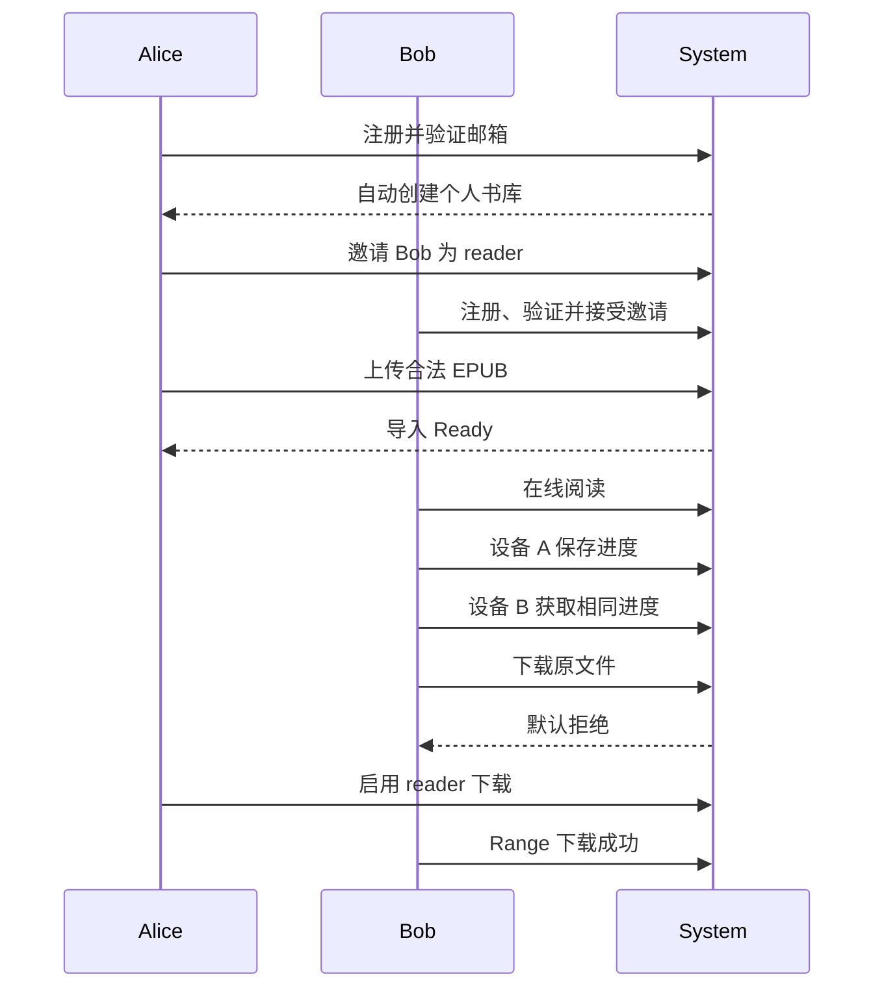

补充验收：

- editor 能上传但不能管理成员；
- reader 上传被拒绝；
- 未加入书库的用户得到防枚举 404；
- 相同 EPUB 重传返回已有 Item；
- Worker 中断后恢复；
- 并发上传不突破配额；
- 删除 Item 不误删共享 Blob；
- 设备进度冲突返回双方状态；
- 从零 migration 通过；存在已发布前一版本后，其升级测试也通过。

## 35. 标准依据

- [IFLA Library Reference Model](https://repository.ifla.org/items/214c74cb-c075-4428-a138-39f8d06c55aa)
- [BIBFRAME 2.0](https://www.loc.gov/bibframe/docs/bibframe2-model.html)
- [EPUB 3.3](https://www.w3.org/TR/epub-33/)
- [Readium Web Publication Manifest](https://readium.org/webpub-manifest/)
- [Readium Locator](https://readium.org/architecture/models/locators/)
- [W3C Web Annotation](https://www.w3.org/TR/annotation-model/)
- [RFC 9457 Problem Details](https://www.rfc-editor.org/rfc/rfc9457.html)
- [W3C Trace Context](https://www.w3.org/TR/trace-context/)
- [OpenAPI 3.1](https://spec.openapis.org/oas/v3.1.1.html)
- [WCAG 2.2](https://www.w3.org/TR/WCAG22/)
- [OWASP Password Storage](https://cheatsheetseries.owasp.org/cheatsheets/Password_Storage_Cheat_Sheet.html)
- [OWASP Session Management](https://cheatsheetseries.owasp.org/cheatsheets/Session_Management_Cheat_Sheet.html)

## 36. 实施前门禁

只有在用户复核本文并明确批准后，才能：

1. 使用 Superpowers Writing Plans 生成实施计划；
2. 设计精确 crate、文件和 migration 拆分；
3. 开始 Rust、TypeScript、SQL 或部署脚手架；
4. 执行测试驱动的实现工作。
